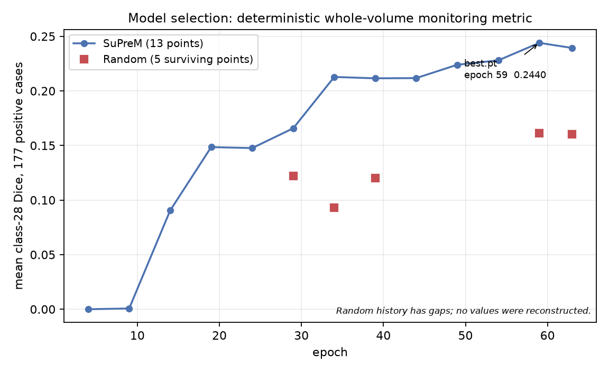
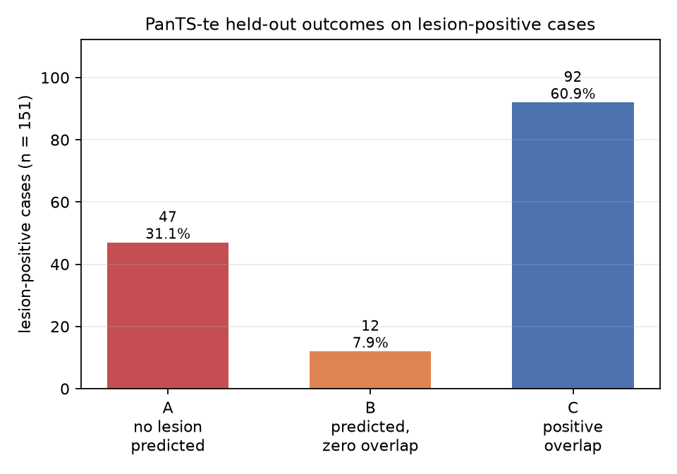

# PanTS Pancreatic Lesion Segmentation

Sabin Thapa
Kent State University
sthapa3@kent.edu

A 3D SegResNet study on [PanTS](https://github.com/MrGiovanni/PanTS) comparing random
initialization against supervised SuPreM initialization, followed by one frozen held-out
PanTS-te evaluation.

## Data

| | |
| --- | --- |
| Source | [github.com/MrGiovanni/PanTS](https://github.com/MrGiovanni/PanTS) |
| PanTS-tr | 9,000 cases (882 lesion-positive) |
| PanTS-te | 901 cases |
| Classes | 29 — background + 28 structures; **class 28 = pancreatic lesion** |
| Split | `pants_cv_v1.json`, seed 317, 5 folds stratified by class-28 presence; fold 0 = 7,199 train / 1,801 validation |

`lesion_present` is defined only by class 28 appearing in `combined_labels`. The split is
case-level, since no patient identifier is released.

## Model and preprocessing

| | |
| --- | --- |
| Architecture | MONAI 3D SegResNet, `blocks_down=[1,2,2,4]`, `init_filters=16`, 29 outputs |
| Initialization | SuPreM `supervised_suprem_segresnet_2100.pth` — 81 of 83 tensors transfer |
| Orientation | RAS |
| Spacing | 1.5 mm isotropic |
| Intensity | `[-175, 250] HU → [0,1]`, clipped |
| Patch | 96³ |

Only `conv_final.2.conv.{weight,bias}` is excluded from transfer: it maps features to class
logits, and SuPreM predicted 32 classes where PanTS needs 29. All transferred weights remain
trainable.

## Training

64 epochs, `DiceCELoss` (background excluded from the Dice term), AdamW lr 1e-4 / weight
decay 1e-5, cosine annealing `T_max=64`, AMP, batch 2 cases × 2 patches, seed 317.

`best.pt` is chosen by a **deterministic whole-volume** mean class-28 Dice over a fixed
227-case monitoring subset, evaluated every 5 epochs. Per-epoch patch-validation loss is
diagnostic only and selects nothing. Both arms selected epoch 59.



Random's monitoring history survives for only 5 of its 13 selection epochs — a Colab
reconnection lost the rest. The missing epochs are left empty; nothing was reconstructed.

## Development result — fold 0, 1,801 cases

| | Random | SuPreM | SuPreM + frozen rule |
| --- | ---: | ---: | ---: |
| mean class-28 Dice (177 positives) | 0.1614 | 0.2440 | 0.2437 |
| positive overlap / 177 | 60 | 95 | 90 |
| false-positive patients / 1,624 | 7 | 201 | 109 |
| internal specificity | 0.9957 | 0.8762 | 0.9329 |
| macro anatomy Dice (1–27) | 0.6852 | 0.6917 | 0.6917 |

SuPreM raises lesion sensitivity substantially and costs specificity. The frozen component
rule recovers most of that specificity for 5 overlap cases, all of which had Dice below
0.036, and leaves anatomy unchanged to seven decimal places.

## Frozen inference rule

```text
argmax over 29 classes
  → 26-connectivity components of class 28
  → keep a component iff its peak class-28 softmax >= 0.6
  → rejected voxels take argmax over channels 0..27 (not background)
  → continuous class-28 probability map left unfiltered
```

Applied in the 1.5 mm frame before inversion to source geometry. **0.6 is a softmax
threshold, not a calibrated probability of malignancy**, and it was selected on fold 0.

## PanTS-te held-out result

Produced once, under **our frozen internal evaluation protocol**.

| | |
| --- | ---: |
| Cases | 901 |
| Lesion-positive | 151 |
| Mean positive-case class-28 Dice | 0.3007 |
| Median positive-case Dice | 0.1764 |
| Positive spatial overlap | 92/151 (60.9%) |
| Internal patient-wise prediction rate | 104/151 (68.9%) |
| False-positive patients | 48/750 |
| Internal specificity | 93.6% |



The public PanTS repository defines P-Sen and T-Sen in prose but does not provide the
complete evaluator, component-matching rule, or patient-scoring implementation. **These are
therefore not official PanTS P-Sen, T-Sen, Spe, AUC or benchmark DSC.** The checkpoint and a
probability-producing inference script are supplied so JHU can apply its official evaluation.

## Inference

```bash
python scripts/infer_segresnet.py \
    --checkpoint PanTS_run/segresnet_suprem/best.pt \
    --input scan.nii.gz \
    --output predictions/ \
    --lesion-peak-probability 0.6 \
    --lesion-probability
```

Needs only this repository, a checkpoint and a raw CT. Writes `combined_labels.nii.gz`
(uint8, 0–28) and optionally `pancreatic_lesion_probability.nii.gz` (float32), both restored
to the source CT shape, affine and orientation.

## Repository structure

```text
src/data/         paths, labels, I/O, manifest, transforms, prepared cache
src/models/       SegResNet + SuPreM transfer
src/training/     trainer + resumable checkpoints
src/evaluation/   inference, metrics, component postprocessing
scripts/          command-line entry points
tests/            162 tests
```

## Reproducibility

The held-out result was produced by tag **`pants-submission-v1`**, source SHA
`72813b288db26dd0f887fe9d29a007fa46bcc764`, checkpoint SHA256
`54bbcf0ceb530fd929d352be11bc8d7b18d22c3925deb62d54fa3d6cfb4cef50` (epoch 59).

Tested with Python 3.11.15, PyTorch 2.13.0+cu126, MONAI 1.5.1. Install PyTorch first to match
your GPU and CUDA runtime, then `pip install -r requirements.txt`.

Detailed data QC evidence is in [TECHNICAL_NOTES.md](TECHNICAL_NOTES.md).

## Limitations

- Single fold, single seed — no cross-fold or seed variance measured.
- Training hardware differs between arms (Colab T4 vs local RTX 4070) and is recorded, so
  this is not a hardware-controlled ablation.
- Small lesions remain hard; small-tertile Dice stays near 0.04 on development data.
- The 0.6 threshold was selected on fold 0, the same fold that selected the checkpoint.
- No official PanTS evaluator is published, so all metrics here are internal.
- Softmax outputs are uncalibrated.

## References

- PanTS — Li et al., NeurIPS 2025 Datasets and Benchmarks Track.
- SuPreM — Li et al., [arXiv:2501.11253](https://arxiv.org/abs/2501.11253).
- MONAI — Medical Open Network for AI.
