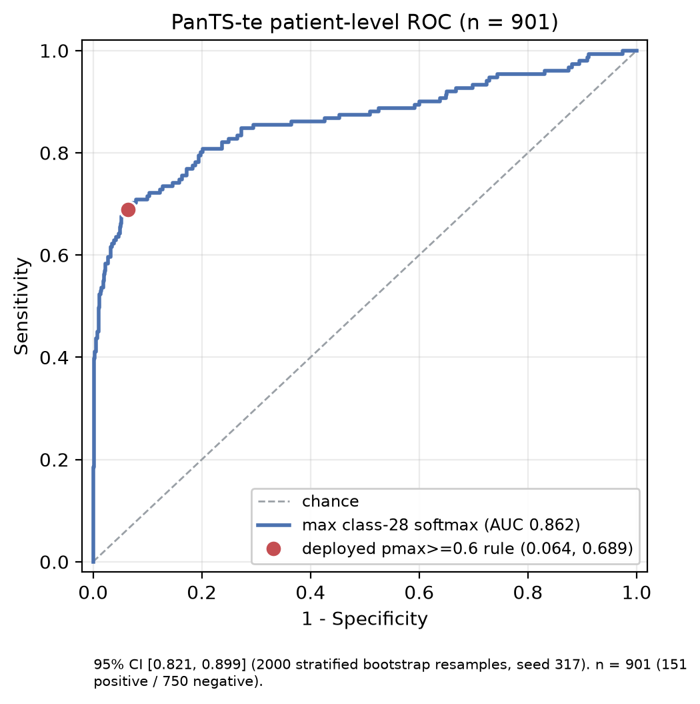

# PanTS Pancreatic Lesion Segmentation

Sabin Thapa
Kent State University
<sthapa3@kent.edu>

A 3D SegResNet study on PanTS comparing random initialization against supervised SuPreM
initialization, followed by one frozen held-out PanTS-te evaluation.

- PanTS dataset and benchmark: <https://github.com/MrGiovanni/PanTS>
- PanTS paper: <https://www.cs.jhu.edu/~zongwei/publication/li2025pants.pdf>
- PanTSMini distribution: <https://huggingface.co/datasets/BodyMaps/PanTSMini>
- SuPreM code and weights: <https://github.com/MrGiovanni/SuPreM>

## Quick start

The following commands run image-only inference with the submitted checkpoint. They do not
download PanTS, prepare training data, or retrain the model.

### Clone the frozen submission

```bash
git clone --branch pants-submission-v5 --depth 1 \
  https://github.com/sabinthapa100/pants_sabin.git

cd pants_sabin
```

### Create the environment

```bash
conda create -n pants python=3.11 -y
conda activate pants
python -m pip install --upgrade pip
```

Install a PyTorch build appropriate for the machine's CPU/GPU and CUDA environment using
the official PyTorch installation selector:

<https://pytorch.org/get-started/locally/>

Then install the remaining inference dependencies:

```bash
python -m pip install -r submission/requirements.txt
```

The inference-only requirements are NumPy, nibabel, MONAI 1.5.1, and SciPy. PyTorch is
installed separately because its wheel depends on the operating system and CUDA platform.

### Download the trained checkpoint

```bash
mkdir -p PanTS_run/segresnet_suprem

python -m pip install gdown

gdown 1GnQuaOzr7ZMzAB67OmNg2h6eO7FYN4rm \
  -O PanTS_run/segresnet_suprem/best.pt
```

Verify that the downloaded file is the checkpoint used for the reported results:

```bash
sha256sum -c submission/SHA256SUMS.txt
```

Expected output:

```text
PanTS_run/segresnet_suprem/best.pt: OK
```

### Run inference

```bash
python scripts/infer_segresnet.py \
  --checkpoint PanTS_run/segresnet_suprem/best.pt \
  --input /path/to/unseen_ct.nii.gz \
  --output output/ \
  --lesion-peak-probability 0.6 \
  --lesion-probability
```

`--input` may be either one `.nii`/`.nii.gz` CT volume or a flat directory containing
multiple CT volumes.

For one input volume, the script writes:

```text
output/
├── combined_labels.nii.gz
└── pancreatic_lesion_probability.nii.gz
```

- `combined_labels.nii.gz` is a `uint8` semantic segmentation with class IDs 0–28.
  Class 28 is the pancreatic lesion.
- `pancreatic_lesion_probability.nii.gz` is the unfiltered class-28 softmax map stored as
  `float32` in `[0,1]`.
- Both outputs are restored to the input CT's shape, affine, and orientation.
- A lesion-only binary mask is obtained with `combined_labels == 28`.

An unlabeled CT produces predictions, not evaluation metrics. Dice, P-Sen, T-Sen,
specificity, and AUC require reference labels from a labeled cohort.

Detailed reviewer instructions are also available in
[`submission/README.md`](submission/README.md).

## Data

PanTS-tr 9,000 cases; PanTS-te 901 cases; 29 exclusive semantic classes; class 28 is the
pancreatic lesion. The image and label files used here came from the PanTSMini distribution,
fetched with the upstream `download_PanTS_data.sh`.

The tracked five-fold split (`pants_cv_v1.json`, seed 317) is **case-level**, because the
released metadata provides no patient-group identifier. Fold 0 is 7,199 train / 1,801
validation.

## Model and preprocessing

| | |
| --- | --- |
| Architecture | MONAI 3D SegResNet, `blocks_down=[1,2,2,4]`, `init_filters=16`, 29 outputs |
| Initialization | SuPreM `supervised_suprem_segresnet_2100.pth` — 81 of 83 tensors transferred |
| Orientation | RAS |
| Spacing | 1.5 mm isotropic |
| Intensity | `[-175, 250] HU → [0,1]`, clipped |
| Patch | 96³ |

Only the output head `conv_final.2.conv.{weight,bias}` is excluded from transfer: SuPreM
predicted 32 classes where PanTS needs 29. All transferred weights remain trainable.

## Training

The submitted checkpoint is the **SuPreM-initialized SegResNet**. A second SegResNet with
random initialization was trained as a comparison. Both models used the same PanTS-tr fold,
sampling strategy, augmentation, loss, optimizer, learning-rate schedule, validation procedure,
and stopping horizon.

| Parameter | Value |
| --- | --- |
| Training fold | Fold 0: 7,199 training / 1,801 validation scans |
| Epochs | 64 |
| Iterations per epoch | 3,600 |
| Total optimizer updates | 230,400 |
| Batch construction | 2 cases × 2 patches per case = 4 patches per iteration |
| Patch size | 96 × 96 × 96 voxels |
| Gradient accumulation | 1 |
| Loss | MONAI `DiceCELoss`, with background excluded from the Dice term |
| Optimizer | AdamW |
| Initial learning rate | `1e-4` |
| Weight decay | `1e-5` |
| Schedule | Cosine annealing over 64 epochs |
| Precision | Automatic mixed precision |
| Seed | 317 |
| Model selection | Whole-volume class-28 Dice on a fixed 227-case monitoring subset |
| Validation cadence | Every 5 epochs |
| Selected checkpoint | Epoch 59 |

The expensive deterministic transforms were performed once and stored in a prepared full-volume
cache. Tumor-aware patch sampling and intensity augmentation remained stochastic during training,
so each epoch presented different patches and augmentations.

The random-initialized model was trained on a Google Colab T4. The SuPreM-initialized model was
trained on an NVIDIA RTX 4070 Laptop GPU with 8 GB VRAM. The scientific protocol was matched,
but the hardware and PyTorch/CUDA environments were different; the comparison is therefore not
a hardware-controlled ablation.

The training entry point is [`scripts/train_segresnet.py`](scripts/train_segresnet.py), and the
checkpoint contains the training configuration, Git commit, manifest hash, split hash, optimizer
state, scheduler state, AMP scaler state, counters, and random-number-generator state.

## Development result

PanTS-tr fold-0 development result:

| | Random | SuPreM | SuPreM + 0.6 filter |
| --- | ---: | ---: | ---: |
| mean class-28 Dice (177 positives) | 0.1614 | 0.2440 | 0.2437 |
| positive spatial overlap / 177 | 60 | 95 | 90 |
| false-positive scans / 1,624 | 7 | 201 | 109 |
| specificity | 0.9957 | 0.8762 | 0.9329 |
| macro anatomy Dice (classes 1–27) | 0.6852 | 0.6917 | 0.6917 |

Single fold, single seed.

## Frozen inference rule

29-class argmax produces the hard label map. Class-28 voxels are grouped into 26-connected
components; a component is retained only if its peak class-28 softmax is >= 0.6. Voxels in
rejected components are reassigned to their best class among 0..27 rather than forced to
background. The continuous class-28 probability map is left unfiltered.

0.6 is a fixed operating threshold selected on fold 0.

## PanTS-te result

901 held-out scans: 151 lesion-positive, 750 lesion-negative, 0 failures.

| Model | P-Sen | T-Sen | Spe | AUC | DSC |
| --- | ---: | ---: | ---: | ---: | ---: |
| SegResNet, SuPreM initialization | 68.9% | 57.8% | 93.6% | 0.862 | 30.1% |

AUC 95% CI [0.821, 0.899], from 2000 stratified patient-level bootstrap resamples, seed 317.

- **P-Sen / Spe** — frozen pmax >= 0.6 hard operating point. 104/151 and 702/750.
- **T-Sen** — 26-connected, maximum-cardinality one-to-one any-overlap matching. 93/161.
- **AUC** — maximum class-28 softmax from the source-restored probability map, resampled to
  1-mm isotropic.
- **DSC** — macro mean over lesion-positive scans.

The PanTS paper defines DSC, sensitivity, specificity and AUC but not P-Sen, T-Sen or any
tumor-matching rule, and no public PanTS implementation specifying individual-tumor matching
was found. The T-Sen matching rule and the AUC patient score above are therefore ours, stated
in full so they can be reproduced or replaced.

Supplementary:

| | |
| --- | ---: |
| micro (pooled) DSC | 50.2% |
| positive spatial overlap | 92/151 |
| zero-Dice scans | 59/151 |
| median lesion DSC | 17.6% |
| ground-truth tumors, matched / total | 93 / 161 |
| prediction but zero overlap | 12/151 |
| no lesion prediction | 47/151 |




## Inference

```bash
python scripts/infer_segresnet.py \
    --checkpoint PanTS_run/segresnet_suprem/best.pt \
    --input unseen_ct.nii.gz \
    --output output/ \
    --lesion-peak-probability 0.6 \
    --lesion-probability
```

Input contract: one 3D CT NIfTI in Hounsfield units with a valid affine.

Outputs `combined_labels.nii.gz` and `pancreatic_lesion_probability.nii.gz`, both restored to
the source CT shape, affine and orientation.

Inference does not need labels, a manifest, a split, prepared training data, or the original
SuPreM checkpoint.

## Reproducibility

| | |
| --- | --- |
| Inference code tag | `pants-submission-v1` (`72813b288db26dd0f887fe9d29a007fa46bcc764`) |
| Metric code tag | `pants-metrics-v1` (`b3fa3a9e13db5510446c9847a7ddde3378f4e5dd`) |
| Final package tag | `pants-submission-v5` |
| Final checkpoint SHA256 | `54bbcf0ceb530fd929d352be11bc8d7b18d22c3925deb62d54fa3d6cfb4cef50` (epoch 59) |
| Environment | Python 3.11.15, PyTorch 2.13.0+cu126, MONAI 1.5.1 |

Methods detail and data QC evidence: [METHODS_AND_QC.md](METHODS_AND_QC.md).

## Limitations

- One fold and one seed.
- Different hardware/software environments between the two arms.
- The 0.6 threshold was selected on fold 0.
- Small-lesion performance remains weak.
- T-Sen matching and the AUC patient score are our definitions, not the benchmark's.
- Probabilities are not calibrated.

## References

- PanTS — Li et al., NeurIPS 2025 Datasets and Benchmarks Track.
- SuPreM — Li et al., [arXiv:2501.11253](https://arxiv.org/abs/2501.11253).
- MONAI — Medical Open Network for AI.
